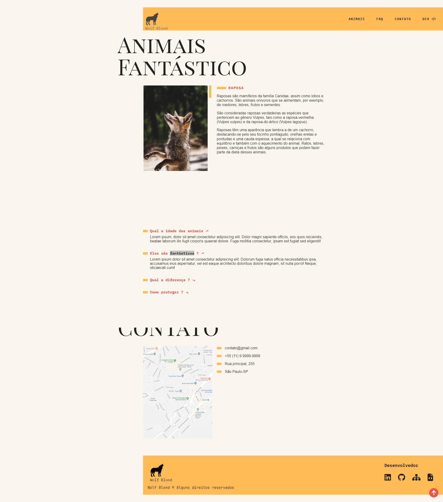

# Animais Fantásticos

Este é o projeto "Animais Fantásticos", um website que exibe informações sobre diversos animais fantásticos do universo da literatura e cinema. O objetivo desse projeto é praticar e aprimorar habilidades em HTML, CSS e JavaScript.

## Tecnologias Utilizadas

- HTML5
- CSS3
- JavaScript

## Instalação

1. Clone o repositório: `git clone https://github.com/JoaoSBarbosa/animais-fantastico.git`
2. Entre na pasta do projeto: `cd animais-fantastico`
3. Abra o arquivo `index.html` no seu navegador.

## Uso

Para visualizar o site ao vivo, basta seguir este link: [https://joaosbarbosa.github.io/animais-fantastico/](https://joaosbarbosa.github.io/animais-fantastico/)
